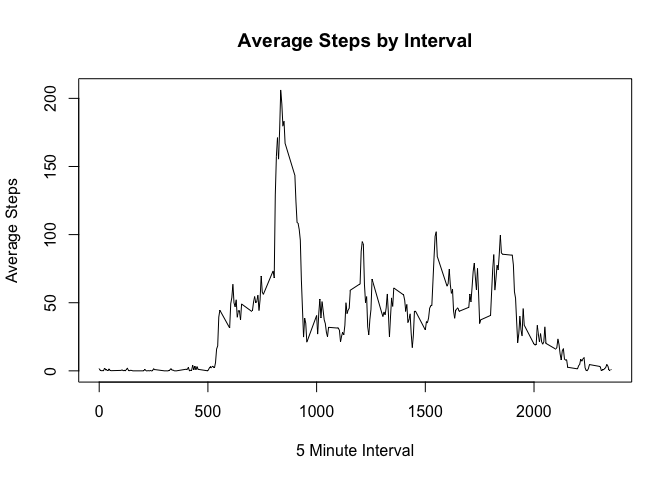

# Reproducible Research: Peer Assessment 1


## Loading and preprocessing the data

```r
library(dplyr)
```

```
## 
## Attaching package: 'dplyr'
```

```
## The following objects are masked from 'package:stats':
## 
##     filter, lag
```

```
## The following objects are masked from 'package:base':
## 
##     intersect, setdiff, setequal, union
```

```r
library(lattice)

mydata <- read.csv("./activity.csv")
mydata$date<-as.Date(mydata$date,"%Y-%m-%d")
```

## What is mean total number of steps taken per day?


```r
ActivityByDay <- group_by(mydata,date)
TotalByDay <- summarize(ActivityByDay,sum(steps,na.rm=TRUE))

hist(TotalByDay$`sum(steps, na.rm = TRUE)`,
     main= "Frequency of Days by Number of Steps",
     xlab = "Steps on any one Day",
     ylab = "Number of Days",
     breaks=20)
```

<!-- -->

```r
DailyStepMean <-mean(TotalByDay$`sum(steps, na.rm = TRUE)`)
DailyStepMedian <-median(TotalByDay$`sum(steps, na.rm = TRUE)`)
```
The mean number of steps per day is 9354.2295082.  
The median number of steps per day is 10395.

## What is the average daily activity pattern?


```r
meanbyint <- summarize(group_by(mydata,interval),mean(steps,na.rm = TRUE))

plot(meanbyint,
      type = "l",
      main = "Average Steps by Interval",
      xlab = "5 Minute Interval",
      ylab = "Average Steps")
```

<!-- -->

What time interval has the maximum average steps?


```r
highestint<- subset(meanbyint,meanbyint$`mean(steps, na.rm = TRUE)`==max(meanbyint$`mean(steps, na.rm = TRUE)`))
```

The interval with the highest number of steps is 835.  

## Imputing missing values

Some rows have NA Values.
How many rows have NA values?

```r
NArows <- sum(is.na(mydata$steps))
```

The NA values will be imputed using the average for a particular 5 minute interval


```r
mydata_na<-subset(mydata,is.na(mydata$steps))
mydata_pop<-subset(mydata,is.na(mydata$steps)==FALSE)

mydata_na_mean <- left_join(mydata_na,meanbyint,by="interval")
mydata_na_mean$steps=NULL
names(mydata_na_mean)[3]<-"steps"

mydata_na_impute <- rbind(mydata_na_mean,mydata_pop)
```
## What is mean total number of steps taken per day using imputed values?


```r
ActivityByDay_na_impute <- group_by(mydata_na_impute,date)
TotalByDay_na_impute <- summarize(ActivityByDay_na_impute,sum(steps,na.rm=TRUE))

hist(TotalByDay_na_impute$`sum(steps, na.rm = TRUE)`,
     main= "Frequency of Days by Number of Steps",
     xlab = "Steps on any one Day",
     ylab = "Number of Days",
     breaks=20)
```

<!-- -->

```r
DailyStepMean2 <-mean(TotalByDay_na_impute$`sum(steps, na.rm = TRUE)`)
DailyStepMedian2 <-median(TotalByDay_na_impute$`sum(steps, na.rm = TRUE)`)
```
The mean number of steps per day is 1.0766189\times 10^{4}.  
The median number of steps per day is 1.0766189\times 10^{4}.

It appears that imputing the NA values increases the mean by 1411.959171 days.  
It appears that imputing the NA values increases the median by 371.1886792 days.  

## Are there differences in activity patterns between weekdays and weekends?

First add a flag for the weekend

```r
mydata$weekday <- weekdays(mydata$date)
mydata$Type<-"Weekday"

mydata$Type[mydata$weekday=="Saturday"]<-"Weekend"
mydata$Type[mydata$weekday=="Sunday"]<-"Weekend"
```

Next graph the data


```r
meanbyint_wknd <- summarize(group_by(mydata,interval,Type),mean(steps,na.rm = TRUE))

xyplot(meanbyint_wknd$`mean(steps, na.rm = TRUE)`~meanbyint_wknd$interval|meanbyint_wknd$Type,
       layout=c(1,2),
       type="l",
       main="Average Steps by Interval - Weekend vs. Weekday",
       xlab = "Interval",
       ylab="Average Steps")
```

<!-- -->
